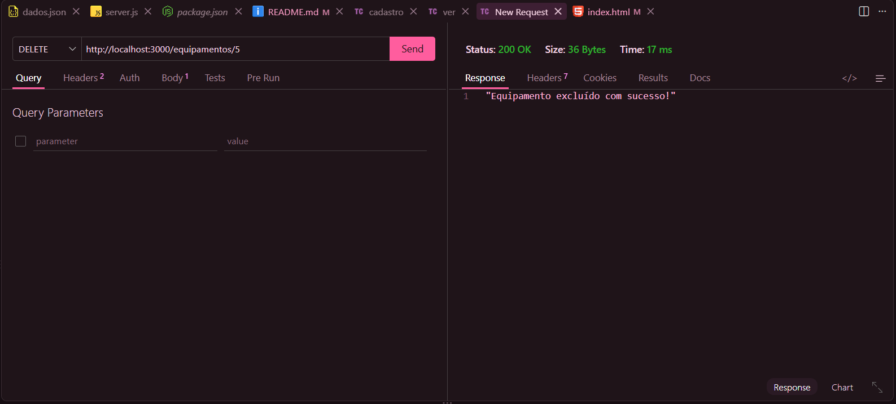
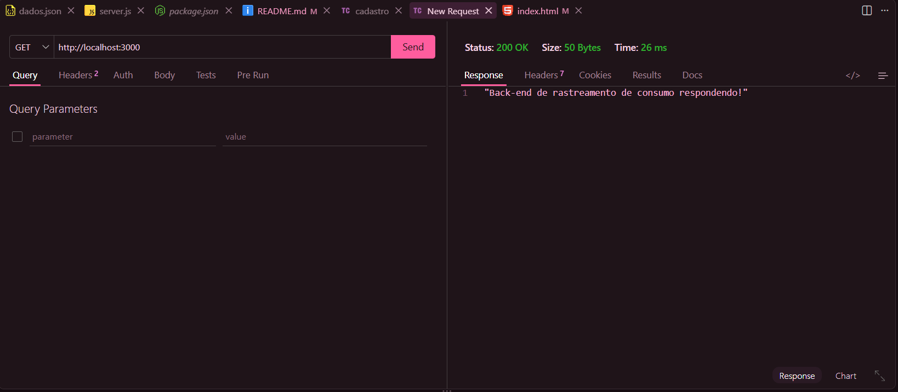
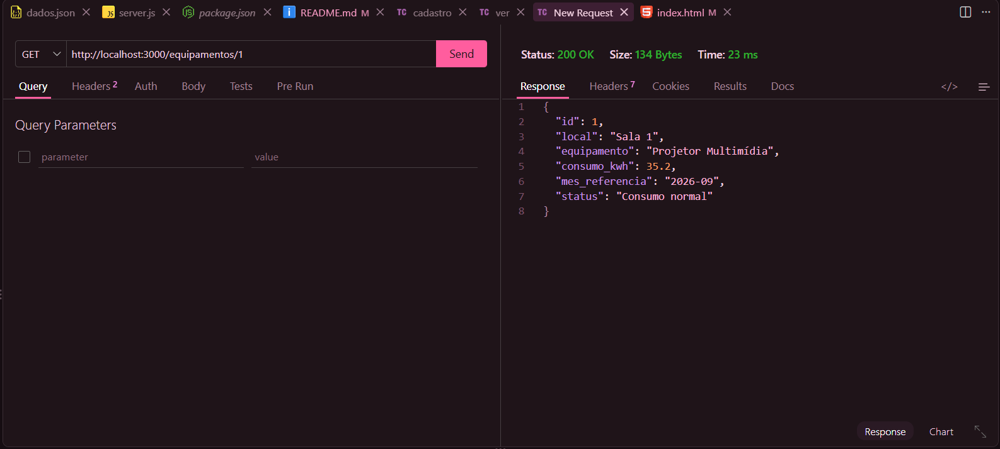
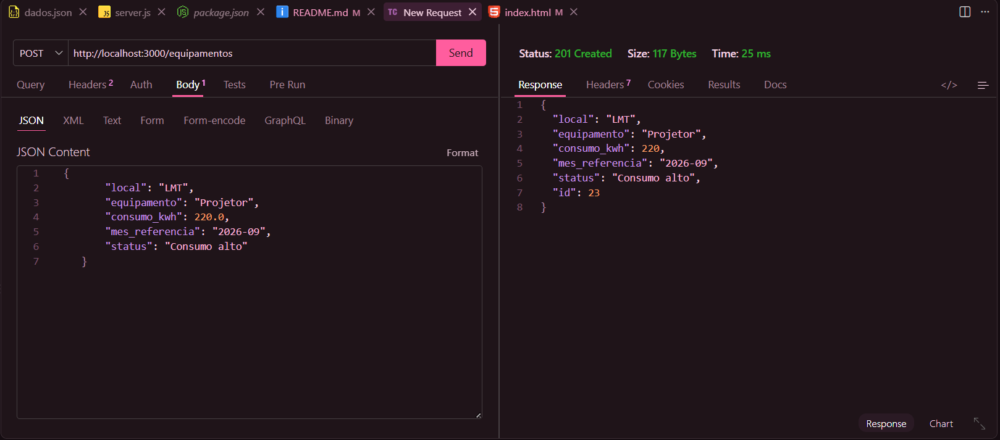
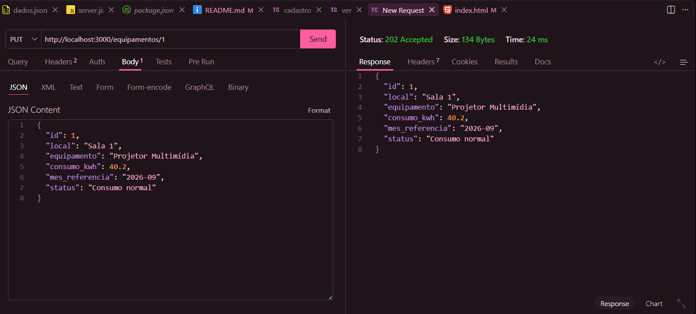
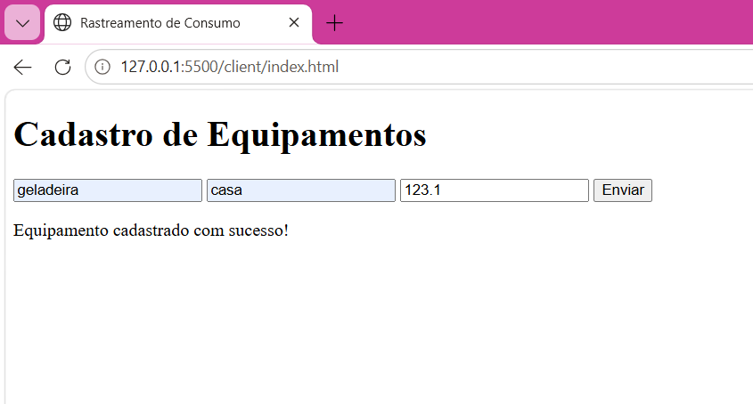

"# sesi_pbe1_vps01_rastreamentoConsumo_2026" 
## Rastreamento de consumo e desperdício de energia
Neste tema foi elaborado um sistema para registrar locais e equipamentos que utilizam energia, com o intuito de acompanhar o consumo elétrico/energético e seus desperdícios.

## Tecnologias
- HTML
- Java Script
- Thunder Client
- VS Code
- Node JS
### Passos para testar
###### Após selecionar o "New Request" na extensão Thunder Client, configure a aba http://localhost conforme o nome do seu server e, suas preferências de ação:
- DELETE = para deletar algum id requisitado  na aba, assim como no print. Exemplo: http://localhost:3000/2. 2 é o id para ser deletado.
- GET = Faz o servidor rodar
- GET/*id*/ = Mostra o item presente nos dados.json
- POST = Envia um novo item ao servidor
- PUT = Atualiza dados no item escolhido
## Prints
``` delete ```

``` get ```

``` get/*id*/ ```

``` post ```

``` put ```

## Formulário
``` Formulário HTML ```
